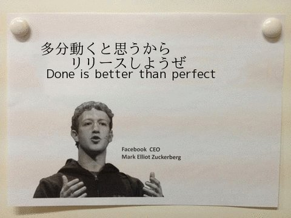
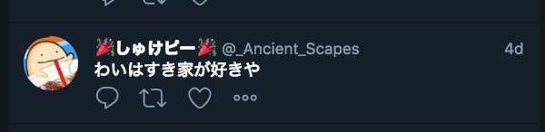
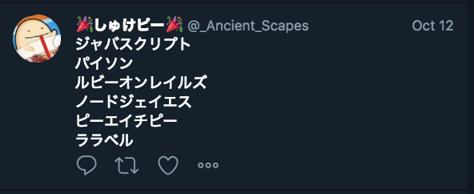

## 勉強、アウトプットできるエンジニアになるためには

---

## こんばんは

----

## LTって知ってますか？

----

## もちろん、ライトニングトークの略ですよね

----

## ライトニングといえば

----

## FF13ですよね

----

## FFといえば

----

## ノムリッシュ翻訳ですよね 

---

## ノムリッシュ翻訳とは？

- [どんな文章もFF風な感じのテキストに翻訳するサービス](https://racing-lagoon.info/nomu/translate.php)のこと。

----

# 試しに翻訳してみる

こまけぇこたぁいいんだよ!!　LTしようぜ!!　アウトプットしようぜ!!

----

# こうなる

こまけぇこたぁ赦すんだよ……！――ッ！　LTしようぜ……！――ッ！　『解放』しようぜ!――ッ！

---

## 今回はこちらをJS,Nodeでも使えるようにライブラリにして公開してみました

- [ノムリッシュ翻訳ライブラリをnpmに公開しました - Qiita](https://qiita.com/SugarShootingStar/items/180b36ac35ef7ab2e2aa)

----

## 5000兆いいね欲しい！

----

## デモを見せます

---

## 自己紹介

  

  
  
  
  

しゅけピー(@_Ancient_Scapes)
- birth:1995/12/04
- like:音ゲー、すき家のチーズ牛丼
- language
  - Node.js
  - JavaScript
  - ブロント語

----

# ひとつお伝えしたいことがあります

----

## 来月から株式会社ゆめみさんで働くことになりました！

----

## サポーターズさんにはお世話になりました

---

# 勉強について

勉強は難しい👼

----

# なぜ？

----

# 理解できないとしんどい

----

## 勉強しようと思って勉強すると挫折してしまう

- しんどいことが目標になっているから続かない

----

### 勉強を目的にしないということ

----

### 勉強するなら、勉強しながら何か作ってみよう

- 自分がワクワクできるものを作るのが大事🚀
- その過程で勉強できたらめっちゃお得

----

### 自分の「好き」と絡めて開発・勉強するとよし

私の例
- カラオケ + Node.js(ES6)
- カラオケで歌えない曲一覧を取得するプログラム

_モチベが続いて結果的に完成した👍_

----

### 作るものはできるだけ小規模に

- 1ヶ月以内に終わるボリュームで作ろう
- 0→1で作るほうが学ぶことが多い

----

### とりあえずテンションを上げる

- すき家を食う
- 自分の好きな曲を聴く
  - spotifyおすすめ

----

## 「完璧」はないという考えを持つ

> 疑って後悔するよりは信じて後悔しようぜ。 行こう。きっと何とかなるさ
> 
> ソードアート・オンライン キリト

---

## アウトプットについて

----

## 行動しなければ何も始まらない

----

## いきなりQiita、Githubはハードルが高くね？

----

## とりあえずしょうもないツイートをしよう

----

## 慣れてきたら技術を絡める

----

# 簡単ですね！

----

## ここでフォローしたほうがいいアカウントを紹介しておきます

----

# @_Ancient_Scapesさん

----

# 通勤時間を使おう(座れるなら)

----

## 通勤電車で寝るのは体に悪いことが証明されています

ソース:[なぜ"帰宅電車での居眠り"は体に悪いのか (1/4) | プレジデントオンライン](https://president.jp/articles/-/24268)

----

## Markdownで書くだけならオフラインでもできる

----

## 通勤がちょっと楽しくなります(個人差があります)

----

# 自分の作ったものの宣伝

---

# まとめ

----

# 自分が楽しいと思える開発をしよう

----

# エンジニア同士で繋がろう

----

---

# ありがとうございました！